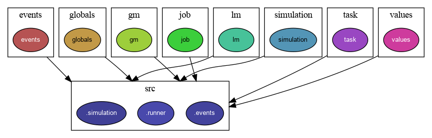

# Megha Simulator

## About
A simple simulator for the Megha Federated Scheduling Framework. This simulator enables comparison with other frameworks such as Sparrow, Eagle and Pigeon for which simulators already exist.


## Running the simulator

Sample command to run with 3 GMs and 2 LMs, and PARTITION_SIZE 3:

```
python3 ./src/runner.py ./Traces/YH.tr ./Simulator_Config/config.json 3 2 3 1 1 1 
```

## Using the Development Environment Container

1. Make the shell script `enter_dev_env.sh` executable using the command:
```bash
$ sudo chmod u+x enter_dev_env.sh
```
2. Run the shell script `enter_dev_env.sh` using the command:
    ```bash
    $ ./enter_dev_env.sh
    ```
   1. This will automatically take you into the container with the project files visible in the current folder itself (try `ls`). As you update the code files in your host system they will be simultaneously updated in the container as well.
   1. Inside the container use Python by `python3`
   1. To 'persist' new module installations inside the container, update the requirements.txt file by running the following command from **inside the container**:
        ```bash
        pip3 freeze > requirements.txt
        ```
3. Once finished using the container, run the command `exit` inside the container to exit it.


## How to Generate the Documentation

1. Make the shell script `doc_gen.sh` executable using the command:
```bash
$ sudo chmod u+x doc_gen.sh
```
2. Run the shell script `doc_gen.sh` using the command:
    ```bash
    $ ./doc_gen.sh
    ```
    1. This will generate the documentation file called `megha_sim.html` in the folder `./html`
    2. Open the file using any modern web browser to view the documentation.

## Dependency Graph



---