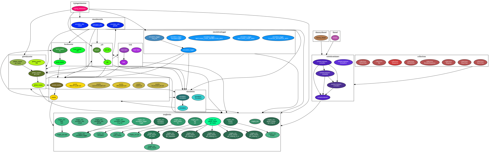

# Megha Simulator

[](https://www.codefactor.io/repository/github/meghanat/megha_simulator)

[](https://github.com/meghanat/megha_simulator/actions/workflows/dev_env.yml)
[](https://github.com/meghanat/megha_simulator/actions/workflows/python-app.yml)
[](https://github.com/meghanat/megha_simulator/actions/workflows/scripts_check.yml)
[](https://github.com/meghanat/megha_simulator/actions/workflows/spelling_action.yml)

[](https://github.com/meghanat/megha_simulator/actions/workflows/anchor.yml)
[](https://github.com/meghanat/megha_simulator/actions/workflows/user_eng.yml)
[](https://github.com/meghanat/megha_simulator/actions/workflows/linting.yml)


## About
A simple simulator for the Megha Federated Scheduling Framework. This simulator enables comparison with other frameworks such as Sparrow, Eagle and Pigeon for which simulators already exist.

## Setting up your Environment

1. Add the ```megha_sim``` folder to your ```PYTHONPATH``` environment variable by following steps:
   1. Open your terminal and in that, navigate into the ```megha_sim``` folder of the project
   2. Once in the ```megha_sim``` folder run the command
        ```bash
        $ pwd
        ```
        - This will give you the complete path to the ```megha_sim``` folder your are currently in.
        - Make sure to save this path returned, as it will be needed in the next steps
    1. Open your system's ```.bash_profile``` file using the command,
       ```bash
       $ nano ~/.bash_profile
       ```
       - Navigate to the bottom of the file
    2. Type in the following into the file,
        ```bash
        export PYTHONPATH="<The_path_returned_by_the_pwd_command_done_earlier>"
        ```
        - Save the file
        - Close the file
    3. Now run the below command on your terminal,
        ```bash
        $ source ~/.bash_profile
        ```
    4. Now run the below command on your terminal,
        ```bash
        $ echo $PYTHONPATH
        ```
        - You should see the path you had put as the value for the ```PYTHONPATH``` in the ```.bash_profile``` visible here
    5. **NOTE:** The same steps can also be done using the ```~/.bashrc``` file instead of the file ```~/.bash_profile```
       1. Using ```~/.bash_profile``` is recommended for systems running MacOS
       2. Any of the 2 files can used for Linux systems
    6. **NOTE:** You will need to ***refresh*** or ***restart*** your IDE after these steps, to get useful syntax highlighting and intellisense when working with the ```megha_sim``` module.

## Running the simulator

Sample command to run with 3 GMs and 2 LMs, and PARTITION_SIZE 3:

```bash
$ python3 ./src/runner.py ./traces/input/YH_small.tr ./simulator_config/config_original.json 3 2 3 1 1 1 
```

By convention, the output of the simulator, after running on a trace must always be saved in the folder `traces/output`. In our example, to save the output of the simulator, after running it on the trace `YH.tr`, into the folder `traces/output`, use the command:

```bash
$ python3 ./src/runner.py ./traces/input/YH_small.tr ./simulator_config/config_original.json 3 2 3 1 1 1 > traces/output/YH_OP.tr
```

**NOTE:** The general convention for naming the output of the simulator, after running it on the trace file is:

```
<Name_of_the_trace_file>_OP.tr
```

## Using the Development Environment Container

1. Make the shell script `enter_dev_env.sh` executable using the command:
```bash
$ sudo chmod u+x enter_dev_env.sh
```
2. Run the shell script `enter_dev_env.sh` using the command:
    ```bash
    $ ./enter_dev_env.sh
    ```
   1. This will automatically take you into the container with the project files visible in the current folder itself (try `ls`). As you update the code files in your host system they will be simultaneously updated in the container as well.
   1. Inside the container use Python by `python3`
   1. To 'persist' new module installations inside the container, update the requirements.txt file by running the following command from **inside the container**:
        ```bash
        pip3 freeze > requirements.txt
        ```
3. Once finished using the container, run the command `exit` inside the container to exit it.

## Sending files to and download files from the Development Server

### To send files to the development server, use the command
```
$ scp -r <local_system_file_path> <ssh_username>@<server_ip_address>:<destination_path_on_server>
```

> **NOTE:** The `-r` flag is used to send the files recursively. This flag can be ignored if only a single file is to be sent.

### To download files from the development server, use the command
```
$ scp -r <ssh_username>@<server_ip_address>:<source_path_on_server> <local_system_file_path>
```

> **NOTE:** The `-r` flag is used to send the files recursively. This flag can be ignore if only a single file is to be downloaded.

## How to Generate the Documentation

1. Make the shell script `build_doc.sh` executable using the command:
```bash
$ sudo chmod u+x build_doc.sh
```
2. Run the shell script `build_doc.sh` using the command:
    ```bash
    $ ./build_doc.sh
    ```
    1. This will generate the documentation file called `runner.html` inside the folder `./html`.
        1. This file contains the generated documentation for the `./src/runner.py` file.
        2. Open this file using any modern web browser to view the documentation for the `./src/runner.py` file.
    2. This command will also generate the folder called `megha_sim` inside the folder `./html`.
        1. This folder will contain the file called `index.html`.
        2. Open this file using any modern web browser to view the documentation for the entire `megha_sim` module.

## How to Generate the Dependency Graph

1. Make the shell script `build_dep_graph.sh` executable using the command:
```bash
$ sudo chmod u+x build_dep_graph.sh
```
2. Run the shell script `build_dep_graph.sh` using the command:
    ```bash
    $ ./build_dep_graph.sh
    ```
    1. This will generate the image of the dependency graph called `megha_sim_dep_graph.png` in the folder `./media/images/`
    2. To see the image of the dependency graph generated, open the file using any image viewing tool.
3. Updating the dependency graph automatically updates the dependency graph shown in this `README.md` file

**NOTE:**

The dependency graph may not show some classes in the project. For example, the `TaskEndEvent` will not show in the dependency graph because it is not imported into any other file/module in the project.

This rule applies to all other such classes and code as well. Below is the reason from the `pydeps` project which we are using:

> `pydeps` finds imports by looking for import-opcodes in python bytecodes (think `.pyc` files). Therefore, only imported files will be found *(ie. `pydeps` will not look at files in your directory that are not imported).*

## Dependency Graph



## Link to the Paper

- [Link to the preprint on arXiv.org](https://arxiv.org/abs/2103.08413)

## Link to the Trace Datasets

- All credits go to the [**EPFL LABOS team**](https://github.com/epfl-labos) for making this link available to everyone
  - [Link to the original repository](https://github.com/epfl-labos/eagle)
- The traces used for evaluating Hawk and Eagle are at:
  - [Dropbox link](https://www.dropbox.com/sh/bhk5zxreyplus73/AADxmp60oqxh7jq9qkCzoJX5a?dl=0)
  - [Link to the original repository notes](https://github.com/epfl-labos/eagle/blob/master/simulation/LOCATION_OF_TRACES.txt)
  - We do not own this (Dropbox) link nor the data hosted on it.

> **NOTE:** that these links may change in the future.
---
