# With Original Approach of Round-Robin:
- **Cluster Size:** 1000
- **Cluster Trace Name:** FB_sub
- **Parameter:** Average Number of Workers searched per Task.

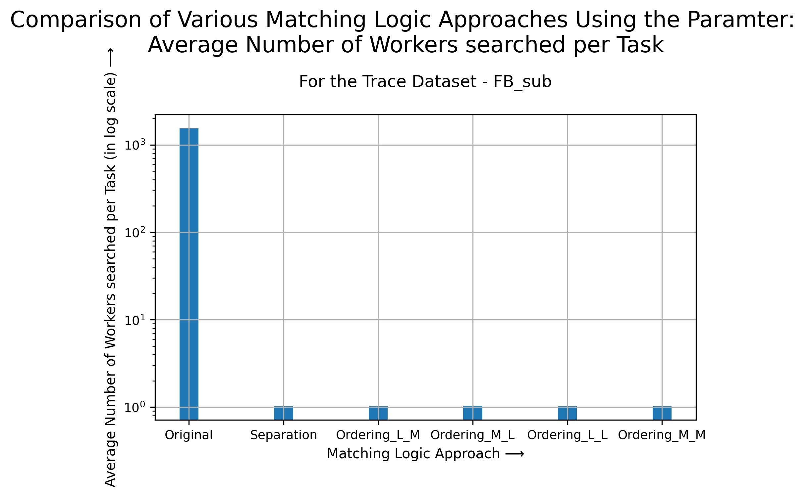

---
- **Cluster Size:** 1000
- **Cluster Trace Name:** FB_sub
- **Parameter:** Total Number of Searches Performed.

---
- **Cluster Size:** 1000
- **Cluster Trace Name:** FB_sub
- **Parameter:** Success Percent (Values are given in %) - Measures how successful a matching logic approach is in finding a free worker node, while maintaining the least number of failed matches (i.e. trying to match an "actually" busy node).

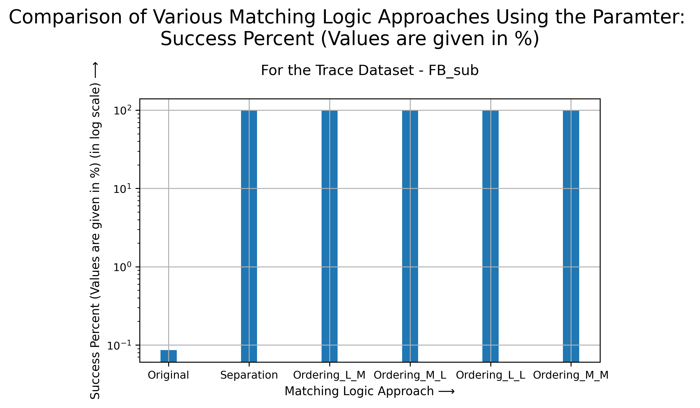

---
- **Cluster Size:** 10000
- **Cluster Trace Name:** FB_sub
- **Parameter:** Average Number of Workers searched per Task.

---
- **Cluster Size:** 10000
- **Cluster Trace Name:** FB_sub
- **Parameter:** Total Number of Searches Performed.

---
- **Cluster Size:** 10000
- **Cluster Trace Name:** FB_sub
- **Parameter:** Success Percent (Values are given in %) - Measures how successful a matching logic approach is in finding a free worker node, while maintaining the least number of failed matches (i.e. trying to match an "actually" busy node).

---
- **Cluster Size:** 1000
- **Cluster Trace Name:** YH1_sub
- **Parameter:** Average Number of Workers searched per Task.

---
- **Cluster Size:** 1000
- **Cluster Trace Name:** YH1_sub
- **Parameter:** Total Number of Searches Performed.

---
- **Cluster Size:** 1000
- **Cluster Trace Name:** YH1_sub
- **Parameter:** Success Percent (Values are given in %) - Measures how successful a matching logic approach is in finding a free worker node, while maintaining the least number of failed matches (i.e. trying to match an "actually" busy node).

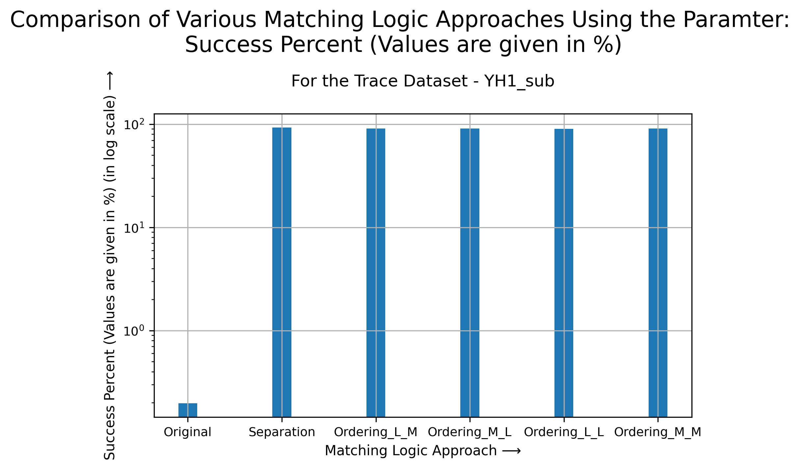

---
- **Cluster Size:** 10000
- **Cluster Trace Name:** YH1_sub
- **Parameter:** Average Number of Workers searched per Task.

---
- **Cluster Size:** 10000
- **Cluster Trace Name:** YH1_sub
- **Parameter:** Total Number of Searches Performed.

---
- **Cluster Size:** 10000
- **Cluster Trace Name:** YH1_sub
- **Parameter:** Success Percent (Values are given in %) - Measures how successful a matching logic approach is in finding a free worker node, while maintaining the least number of failed matches (i.e. trying to match an "actually" busy node).

---
- **Cluster Size:** 1000
- **Cluster Trace Name:** YH2_sub
- **Parameter:** Average Number of Workers searched per Task.

---
- **Cluster Size:** 1000
- **Cluster Trace Name:** YH2_sub
- **Parameter:** Total Number of Searches Performed.

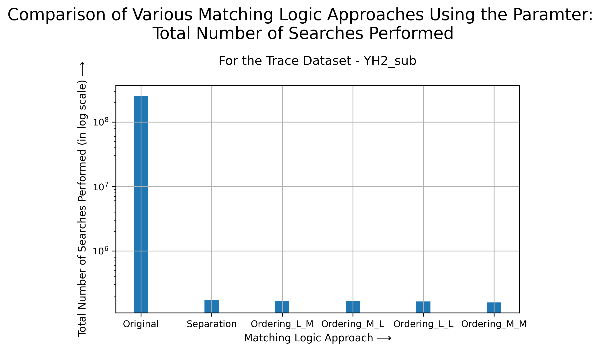

---
- **Cluster Size:** 1000
- **Cluster Trace Name:** YH2_sub
- **Parameter:** Success Percent (Values are given in %) - Measures how successful a matching logic approach is in finding a free worker node, while maintaining the least number of failed matches (i.e. trying to match an "actually" busy node).

---
- **Cluster Size:** 10000
- **Cluster Trace Name:** YH2_sub
- **Parameter:** Average Number of Workers searched per Task.

---
- **Cluster Size:** 10000
- **Cluster Trace Name:** YH2_sub
- **Parameter:** Total Number of Searches Performed.

---
- **Cluster Size:** 10000
- **Cluster Trace Name:** YH2_sub
- **Parameter:** Success Percent (Values are given in %) - Measures how successful a matching logic approach is in finding a free worker node, while maintaining the least number of failed matches (i.e. trying to match an "actually" busy node).

---
# Without Original Approach of Round-Robin:
- **Cluster Size:** 1000
- **Cluster Trace Name:** FB_sub
- **Parameter:** Average Number of Workers searched per Task.

---
- **Cluster Size:** 1000
- **Cluster Trace Name:** FB_sub
- **Parameter:** Total Number of Searches Performed.

---
- **Cluster Size:** 1000
- **Cluster Trace Name:** FB_sub
- **Parameter:** Success Percent (Values are given in %) - Measures how successful a matching logic approach is in finding a free worker node, while maintaining the least number of failed matches (i.e. trying to match an "actually" busy node).

---
- **Cluster Size:** 10000
- **Cluster Trace Name:** FB_sub
- **Parameter:** Average Number of Workers searched per Task.

---
- **Cluster Size:** 10000
- **Cluster Trace Name:** FB_sub
- **Parameter:** Total Number of Searches Performed.

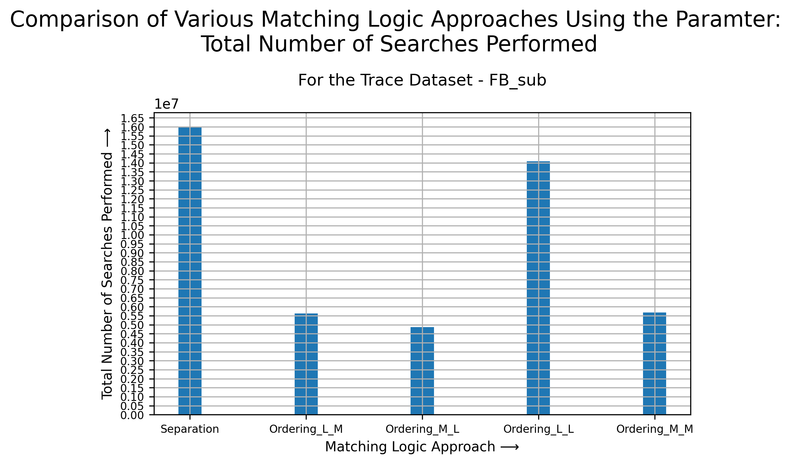

---
- **Cluster Size:** 10000
- **Cluster Trace Name:** FB_sub
- **Parameter:** Success Percent (Values are given in %) - Measures how successful a matching logic approach is in finding a free worker node, while maintaining the least number of failed matches (i.e. trying to match an "actually" busy node).

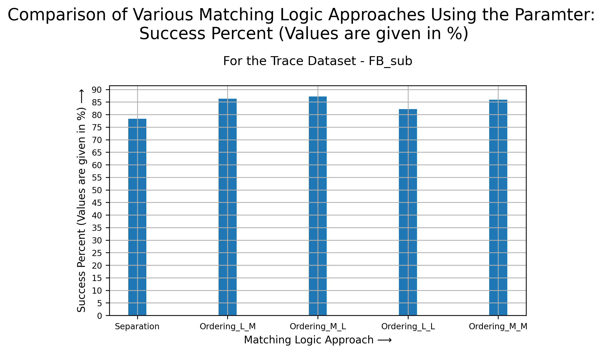

---
- **Cluster Size:** 1000
- **Cluster Trace Name:** YH1_sub
- **Parameter:** Average Number of Workers searched per Task.

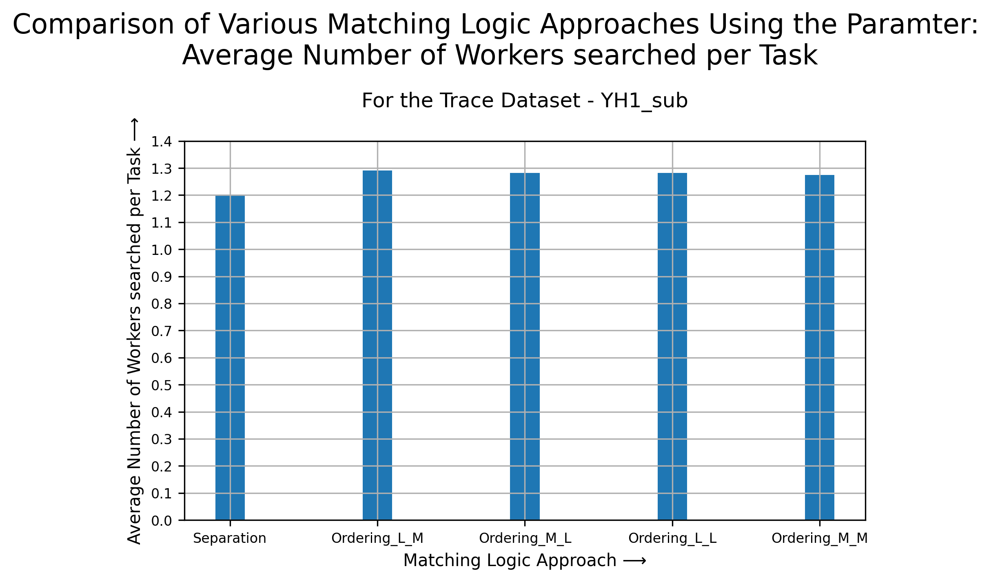

---
- **Cluster Size:** 1000
- **Cluster Trace Name:** YH1_sub
- **Parameter:** Total Number of Searches Performed.

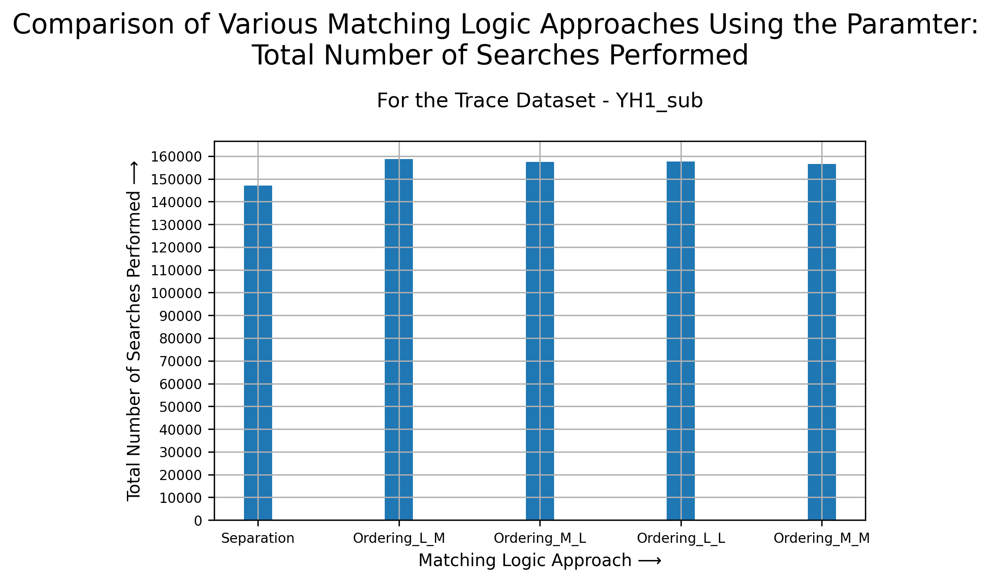

---
- **Cluster Size:** 1000
- **Cluster Trace Name:** YH1_sub
- **Parameter:** Success Percent (Values are given in %) - Measures how successful a matching logic approach is in finding a free worker node, while maintaining the least number of failed matches (i.e. trying to match an "actually" busy node).

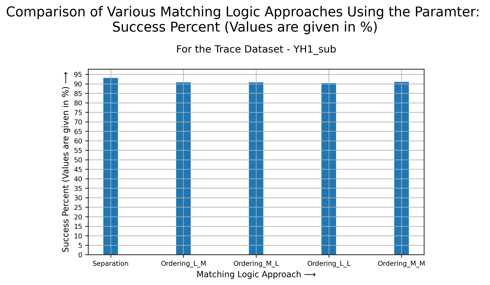

---
- **Cluster Size:** 10000
- **Cluster Trace Name:** YH1_sub
- **Parameter:** Average Number of Workers searched per Task.

---
- **Cluster Size:** 10000
- **Cluster Trace Name:** YH1_sub
- **Parameter:** Total Number of Searches Performed.

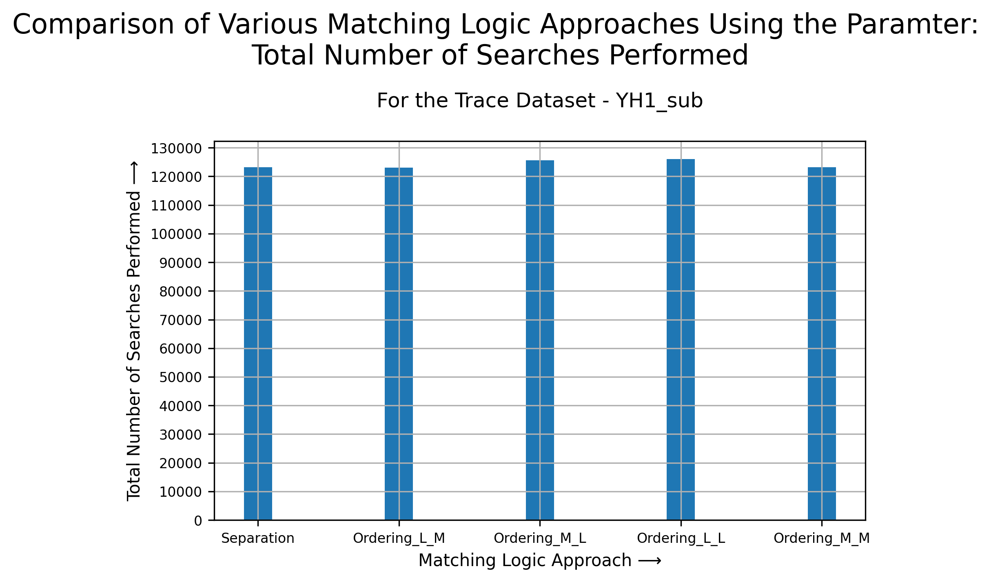

---
- **Cluster Size:** 10000
- **Cluster Trace Name:** YH1_sub
- **Parameter:** Success Percent (Values are given in %) - Measures how successful a matching logic approach is in finding a free worker node, while maintaining the least number of failed matches (i.e. trying to match an "actually" busy node).

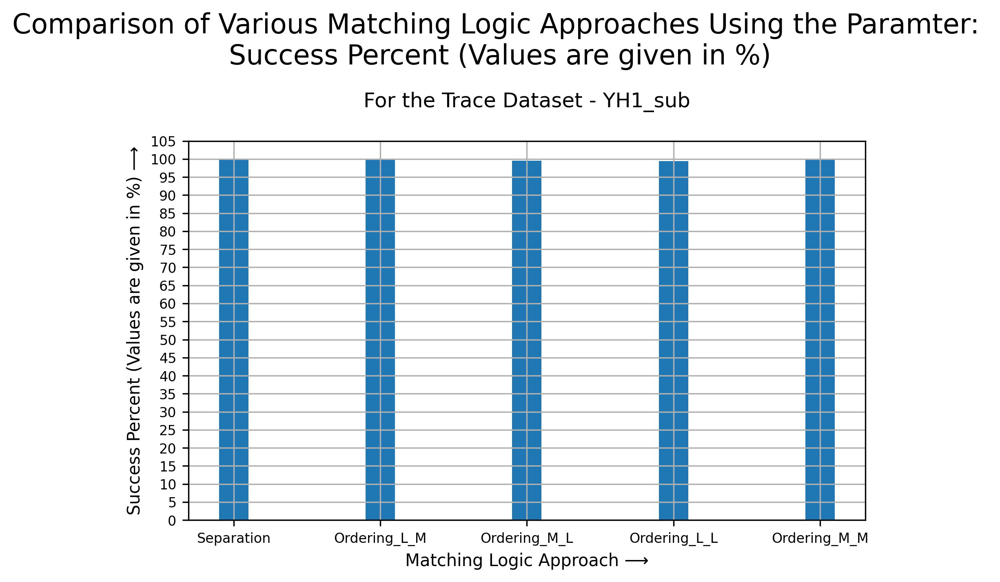

---
- **Cluster Size:** 1000
- **Cluster Trace Name:** YH2_sub
- **Parameter:** Average Number of Workers searched per Task.

---
- **Cluster Size:** 1000
- **Cluster Trace Name:** YH2_sub
- **Parameter:** Total Number of Searches Performed.

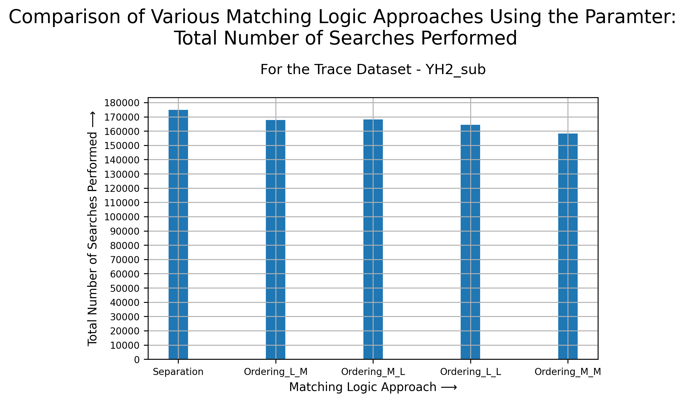

---
- **Cluster Size:** 1000
- **Cluster Trace Name:** YH2_sub
- **Parameter:** Success Percent (Values are given in %) - Measures how successful a matching logic approach is in finding a free worker node, while maintaining the least number of failed matches (i.e. trying to match an "actually" busy node).

---
- **Cluster Size:** 10000
- **Cluster Trace Name:** YH2_sub
- **Parameter:** Average Number of Workers searched per Task.

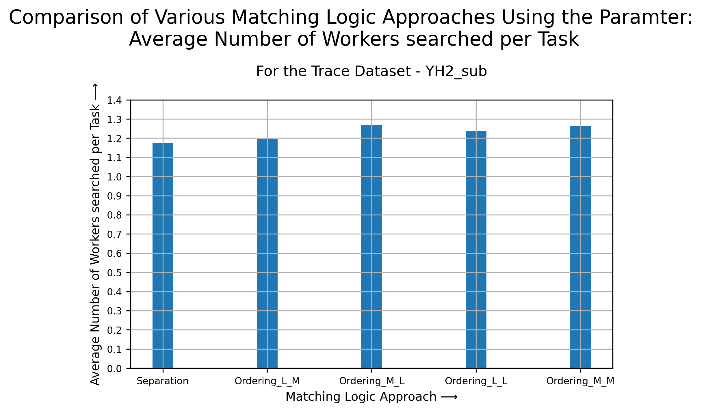

---
- **Cluster Size:** 10000
- **Cluster Trace Name:** YH2_sub
- **Parameter:** Total Number of Searches Performed.

---
- **Cluster Size:** 10000
- **Cluster Trace Name:** YH2_sub
- **Parameter:** Success Percent (Values are given in %) - Measures how successful a matching logic approach is in finding a free worker node, while maintaining the least number of failed matches (i.e. trying to match an "actually" busy node).

---
